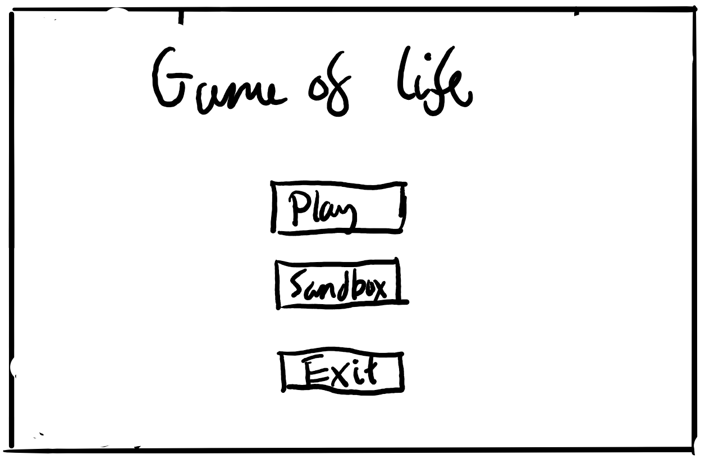
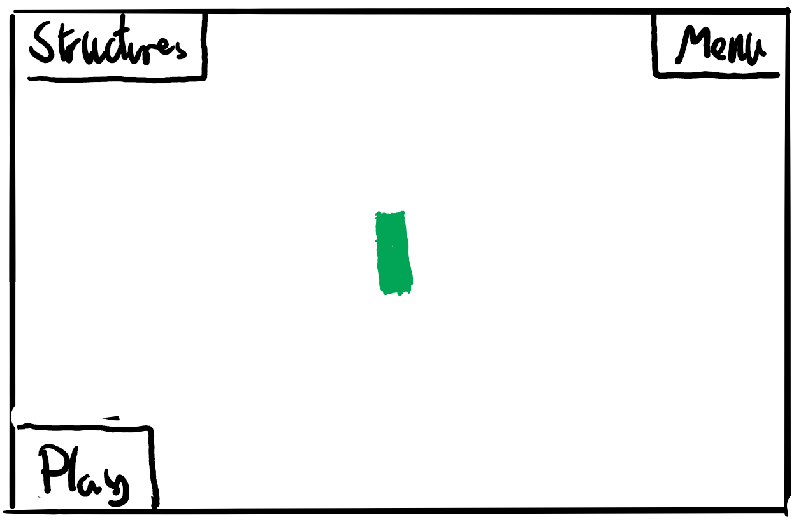
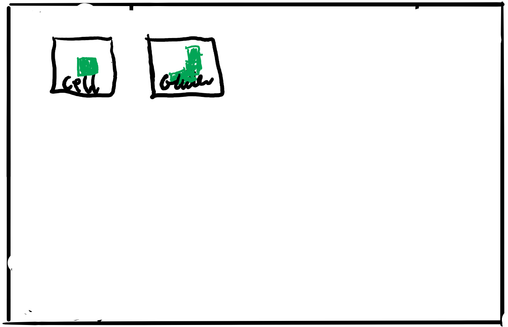

# JC's Game Of Life

# Analysis

## Cellular Automata: a system involving a finitely dimensioned grid, where cells can exist in one of a finite number of states (e.g. on and off), and where a cell's neibourhood is directly affected by it, under a finite number of rules, usually a mathmatical function.

## 1.1 Intoduction

We decided to create a program to simulate cellular automata. This is a system involving a finitely dimensioned grid, where cells can exist in one of a finite number of states (e.g. on and off), and where a cell's neibourhood is directly affected by it, under a finite number of rules, usually a mathmatical function. Depending on the pattern of cells, they can either create or destroy a cell, this allows the program, depending on the pattern, to create a moving object and also simulate a very basic version of cellular interactions.
Our program should allow the user to explore and view a randomly generated map, and also allow them to create their own patterns on a blank map.

## 1.2 Background

Conway's Game of Life is a form of Celular Automaton created by John Conway in 1970, often refered to as just 'Life'. It is a Zero-Player Game, meaning the only input is the initial state of the 'universe' and interaction of the 'player' beyond this point is limited to observation of the outcome. Conway's study was based on the work of John von Neumann, who some years prior (late 1940) defined life as a creation (as a being or organism) which can reproduce itself and simulate a Turing machine. This definition was taken by Stanislaw Ulam, who invented Cellular Automata intended to simulate Neumann's theoretical constructions of life.

Conway began his experiments in 1968, testing a variety of different laws for a two dimensional Cellular Automata. He devised a set of criteria, ensuring that the laws he created would fit the following conditions:

1. There should be no explosive growth.
2. There should exist small initial patterns with chaotic, unpredictable outcomes.
3. There should be potential for von Neumann universal constructors.
4. The rules should be as simple as possible, whilst adhering to the above constraints

The Game of Life first appeared in the magazine: 'Scientific American' in October 1970, in a Mathematical Games column written by Martin Gardner. Since then The Game of Life has been involved in many studies in a variety of different fields, including computer science, physics, biology, biochemistry, economics, mathematics, philosophy, and generative sciences. Studies by cognative scientist Daniel Dennet even used the Game of Life to illustrate the rise of philisophical constructs such as consciousness and free will from the basic laws of our universe.

The Game of Life is a basic cellular automata, existing in an infinite, two-dimensional, orthoganal universe of cells, where each cell can be in either one of two states: Alive or Dead. A cell's state at the initial point of the game is decided upon by the player, and is determined from then on by a set of laws.
The Laws of The Game of Life's 'universe' are as follows:

1. If a dead cell has exactly three neighbors, it comes to life.
2. If a live cell has two or three neibors, it stays alive.
3. Any live cell not meeting the above criteria dies, and likewise, any dead cell not meeting the criteria stays dead.

## 1.3 End User Input

Questions we could have asked in our survey:

1. Have you ever come across the Game of life before?
2. Have you ever played the Game of Life before?
3. Do you know the laws behind the game?
4. Are you aware of any patterns from the Game of Life, such as gliders, spaceships or oscillators?
5. Would you prefer a simple GUI with limited control, or a more complicated GUI with more control over the game?
6. Is the ability to add pre-made structures into the game a good idea?

## 1.4 Objectives

Objectives for the project:

1. Create a functioning version of Conway's game of life.
2. Maybe create an interactive interface so that a user can create their own start patterns.
3. Add a file reading function, so patterns can be taken from a user's file.
4. Add a save to file function, so a user can save their progress on a certain pattern.

The extent to which each objective has been achieved:

1. We have a fully functioning game of life, with all the bugs we've found along the way removed.
2. Sandbox mode is an interactive interface, allowing the player to create their own start patterns with the cell structure.
3. The file reading function works for both regular and apple keyboards, including the ability to freely navigate the textbox input using the mouse and arrow keys.
4. The save to file function operates perfectly.

Extra features we've added:

1. Players can add more structures than just single cells, other strucures include gliders and spaceships.
2. The creation of user patterns is not limited to starting patterns, instead the board can be edited at any time in sandbox and file mode.
3. Players can also pause the game at any time in all three modes.

## 1.5 Proposed Solution

The program will be written in processing-java as it allows us to easily create a GUI. It will also be split up into multiple menus, to make it easier to navigate the program and also to minimise repeating code.
The main menu was just a simple menu to chose if you wanted the default mode (play) where a world is randomly generated or the sandbox mode which allowed you to create their own pattern.

The GUI allows the user to play or pause the game, in the bottom left corner, go back to the menu, in the top right corner, or access the structures through the "Structures" button in the top left

The "Structures" button would take you to a menu to select which structure to place in.

The program will use a boolean 2d array to store the board, which contains all the cells. The cells will be represented by a boolean variable (whether they are alive, true, or dead, false). As the board is much bigger than what can be represented on the screen, we will allow the user to traverse the board with the arrow keys. Objects will also be used for the menu features (e.g. the buttons).

## 1.6 Challenges

We predicted a few challenges that we might face when creating the game. First of all, the representation of all the cells, as we could have represented them as a class with co-ordinates. However, this would have made it tricky to create the system for creating and deleting cells. So instead, we decided to use a 2d array and effectively allow a cell to be dead and also be visible to the program.
Another problem, was to render the board correctly and make a smooth transision. A solution to this is to render cells the cells around the screen, that are not totally visible to the user, this makes the traversal of the board smooth. This allows us to not render the whole board, which would make the program slow, while also making it feel as though the whole board is rendered at once.

# 2 Design

In design.docx

# 3 Evaluation

Suggest Improvements:

1. Add a larger range of structures.
2. Add a speed controller to the game, so the player can change how fast the game moves.
3. Add a "single stage" button, so the user can move forward one stage at a time.

# 4 Significant Versions:

1. ee026b2 - Initial layout. - 2/5/2020
2. 5449aff - Changed to 2d Array System. - 5/5/2020
3. 74e3e46 - First working God function. - 6/5/2020
4. 4c6b5c4 - Split the program into several different files. - 7/5/2020
5. 62560f9 - First implementation of GUI. - 9/5/2020
6. a635c8d - Switched from int based system to boolean. - 9/5/2020
7. bae9ae4 - Added readFromFile function. - 13/5/2020
